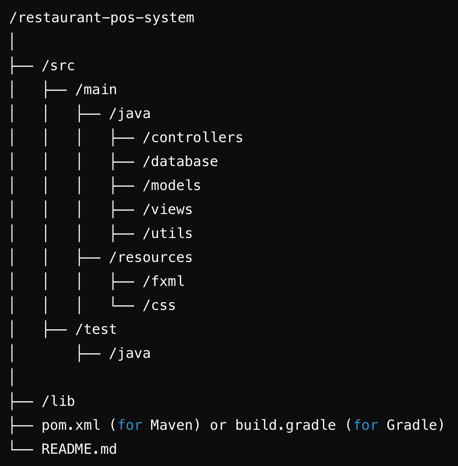

This JavaFX project was created using Oracle OpenJDK 21.0.2 and Maven 3.9.9

## Dependencies
1. OpenJDK 21.0.2: https://www.oracle.com/java/technologies/downloads/#java21
2. Maven 3.9.9: https://maven.apache.org/download.cgi
3. JavaFX 21
4. (To be added) JDBC

## Directory Structure

### src
- **Controllers:** "controller" classes that facilitate the interaction between the frontend and backend
- **Database:** logic that connects & interacts with the PSQL database
- **Models:** definitions of Java objects we use to represent SQL entries (e.g. Order, MenuItem, etc.)
- **Views:** (not sure if we need this) contains view logic
- **Utils:** put any helper classes here
- **resources/fxml:** layout files
- **resources/css:** CSS styles for the fxml files

[UML Diagram](https://lucid.app/lucidchart/edc7b3e7-1ac3-4c09-a9b1-df7ae15d715a/edit?beaconFlowId=69964FEB7EDD1641&invitationId=inv_389b87d7-a0f5-4018-9b37-7d2548e449de&page=0_0)                                                                                                                                                                                                                                                                                                                                                                                                                                                                                                                                                  